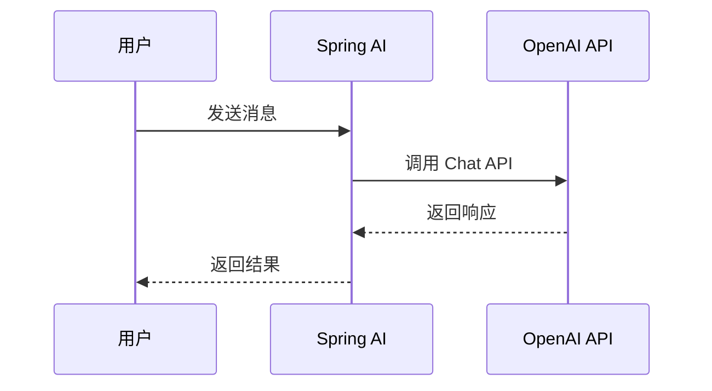

# 关于这个项目

## 📖 背景

作为一名 Java 开发者，在 AI 技术如火如荼的今天，我意识到学习 **Spring AI** 可能是从传统 Java 开发转向 AI 开发的一条理想路径。**Spring AI** 完全基于 **Spring Boot** 构建，这意味着我不需要从头学习全新的技术栈，可以直接利用已有的 Spring 生态知识，大大降低了学习门槛。

因此，我创建这个项目的初衷很简单：记录下自己学习 **Spring AI** 的整个历程，将遇到的问题、解决方案和实践经验整理成文档，希望能帮助更多和我一样的 Java 开发者快速上手 AI 开发。

### 目标

- 🎯 **循序渐进**：从基础入门到高级应用，包含 20+ 个学习模块
- 💡 **实用性强**：每个模块都包含完整的代码示例和最佳实践
- 🚀 **快速上手**：5 分钟快速搭建第一个 Spring AI 项目
- 📚 **知识全面**：涵盖 Prompts、RAG、MCP、Vector Database 等核心功能

### 技术栈

- **Spring Boot**: 3.5.8
- **Spring AI**: 1.1.0
- **Java**: 25 (其实 17+ 就可以, 但毕竟是教程类的项目, 可以顺带了解一下新特性)
- **文档构建**: VitePress 1.6.3

## 🤝 如何贡献

我们欢迎所有形式的贡献！无论是修复 bug、添加新功能、改进文档还是优化代码，都非常感谢。

### 贡献流程

1. **Fork 项目**：点击右上角的 Fork 按钮，将项目 Fork 到你的 GitHub 账号

2. **克隆仓库**：
   ```bash [bash]
   git clone https://github.com/YOUR_USERNAME/spring-ai-cookbook.git
   cd spring-ai-cookbook
   ```

3. **创建分支**：
   ```bash [bash]
   git checkout -b feature/your-feature-name
   # 或
   git checkout -b fix/your-bug-fix
   ```

4. **进行修改**：按照代码规范和文档规范进行开发

5. **提交代码**：
   ```bash [bash]
   git add .
   git commit -m "feat: 添加新功能描述"
   git push origin feature/your-feature-name
   ```

6. **创建 Pull Request**：在 GitHub 上创建 Pull Request，详细描述你的修改内容

### 提交信息规范

我们使用 [Conventional Commits](https://www.conventionalcommits.org/) 规范：

- `feat`: 新功能
- `fix`: 修复 bug
- `docs`: 文档更新
- `style`: 代码格式调整（不影响代码逻辑）
- `refactor`: 代码重构
- `test`: 测试相关
- `chore`: 构建工具或辅助工具的变动

示例：

```bash [bash]
feat: 添加 OpenAI Chat Model 支持
fix: 修复 RAG 检索时的空指针异常
docs: 更新快速开始文档
```

## 📐 代码规范

### Java 代码规范

本项目遵循 **Google Java Style Guide**，并配置了 Checkstyle 和 Google Java Format 进行代码检查。

#### 基本规范

- **缩进**：使用 4 个空格，不使用 Tab
- **行长度**：最大 120 个字符
- **编码**：UTF-8
- **换行符**：Unix 风格（LF）

#### 编辑器配置

项目已配置 `.editorconfig`，支持该规范的编辑器会自动应用格式：

```ini
[*]
charset = utf-8
end_of_line = lf
insert_final_newline = true
trim_trailing_whitespace = true

[*.java]
indent_style = space
indent_size = 4
max_line_length = 120
```

#### 代码格式化

使用 Google Java Format (AOSP 风格)：

```bash [bash]
# 格式化单个文件
mvn com.spotify.fmt:fmt-maven-plugin:format -pl <module-name>

# 格式化所有模块
mvn com.spotify.fmt:fmt-maven-plugin:format
```

#### Checkstyle 检查

```bash [bash]
# 检查单个模块
mvn checkstyle:check -pl <module-name>

# 检查所有模块
mvn checkstyle:check
```

### 代码风格要求

1. **类命名**：使用 PascalCase，如 `ChatClientService`
2. **方法命名**：使用 camelCase，如 `getChatResponse()`
3. **常量命名**：使用 UPPER_SNAKE_CASE，如 `MAX_RETRY_COUNT`
4. **包命名**：使用小写字母，多个单词用点分隔，如 `dev.dong4j.ai.chat`
5. **注释**：所有公共类和方法必须添加 JavaDoc 注释

## 📝 文档规范

### 文档结构

每个模块的文档应包含以下部分：

1. **一级标题**：清晰描述模块功能
2. **简介**：模块的作用和适用场景
3. **快速开始**：如何快速运行示例代码
4. **详细说明**：核心概念和使用方法
5. **相关链接**：相关的官方文档或其他模块
6. 其他觉得有必要添加的内容

**一级标题** 将作为教程主页的菜单, (不要超过 20 个字符).

文档在部署时会自动添加 **代码示例**, **贡献者 **和 **页面历史** 3 个二级章节内容.

所以只需要专注教程内容编写, 其他的全部由脚本自动完成.

#### 标题结构规范

文档必须遵循以下标题结构规则：

1. **Frontmatter 要求**：每个文档开头必须包含 frontmatter，格式如下：
   ```yaml
   ---
   published: 2025.10.01
   ---
   ```

2. **一级标题后的结构**：
   - 第一个一级标题和第一个二级标题之间**不能有任何内容**（可以有空行）
   - 如果一级标题后直接跟有内容，需要在第一个一级标题后添加一个二级标题（不一定是"概述"，可以是任何合适的二级标题）
   - 如果文档中只有一级标题，也需要添加一个二级标题来承载内容

**正确示例**：

```markdown
---
published: 2025.10.01
---

# 多模态 API

## 概述

多模态 API 允许在对话中同时使用文本和图像等媒体内容。
```

**错误示例**（一级标题后直接跟内容）：

```markdown
# 多模态 API

多模态 API 允许在对话中同时使用文本和图像等媒体内容。  <!-- ❌ 错误 -->

## 概述
```

---

### Markdown 规范

- **代码块**：使用语法高亮，如 ` ```java` 或 ` ```bash`
- **链接**：使用 **双向链接** 链接到其他文档，比如:  `[[1.spring-ai-started/index|快速开始]] `
- **图片**：
    - 使用相对路径，存储在模块的 `imgs/` 目录下
    - 图片路径示例：``

> 推荐使用 Typora 编辑, 可以设置图片保存路径:
>
> 
>

---

### VitePress 特殊语法

基于 VitePress 构建，支持丰富的 Markdown 扩展语法，可以让文档更加生动和易读。

#### 代码图标

在代码块中添加文件图标，使用文件名作为标签即可自动显示对应的图标：

**Markdown 源代码**：

````markdown
```java [java]
public static void main(String[] args) {}
```
````

**渲染效果**：

```java [java]
public static void main(String[] args) {}
```

#### 代码组（Code Group）

展示多种安装或使用方式的代码块组合：

**Markdown 源代码**：

````markdown
::: code-group

```sh [npm]
npm install spring-ai-openai-spring-boot-starter
```

```sh [yarn]
yarn add spring-ai-openai-spring-boot-starter
```

```sh [pnpm]
pnpm add spring-ai-openai-spring-boot-starter
```

```sh [bun]
bun add spring-ai-openai-spring-boot-starter
```

:::
````

**渲染效果**：

::: code-group

```sh [npm]
npm install spring-ai-openai-spring-boot-starter
```

```sh [yarn]
yarn add spring-ai-openai-spring-boot-starter
```

```sh [pnpm]
pnpm add spring-ai-openai-spring-boot-starter
```

```sh [bun]
bun add spring-ai-openai-spring-boot-starter
```

:::

#### 时间线（Timeline）

展示事件或步骤的时间线：

**Markdown 源代码**：

````markdown
::: timeline 2023-05-24

- **Spring AI 首次发布**
- 支持 OpenAI 集成
- 支持 Azure OpenAI

:::

::: timeline 2023-05-23

- Spring AI 项目启动
- 社区反馈收集

:::
````

**渲染效果**：

::: timeline 2023-05-24

- **Spring AI 首次发布**
- 支持 OpenAI 集成
- 支持 Azure OpenAI

:::

::: timeline 2023-05-23

- Spring AI 项目启动
- 社区反馈收集

:::

#### 思维导图（Markmap）

使用 Markmap 创建可交互的思维导图：

**Markdown 源代码**：

````markdown
```markmap
# Spring AI
## Chat Model
- OpenAI
- Anthropic
- Ollama
## Embedding Model
- OpenAI Embeddings
- Azure OpenAI Embeddings
## Image Model
- DALL-E
- Stability AI
```
````

**渲染效果**：

```markmap
# Spring AI
## Chat Model
- OpenAI
- Anthropic
- Ollama
## Embedding Model
- OpenAI Embeddings
- Azure OpenAI Embeddings
## Image Model
- DALL-E
- Stability AI
```

#### 流程图（Mermaid）

使用 Mermaid 创建流程图、时序图、甘特图等：

**Markdown 源代码**：

````markdown

````

**渲染效果**：


#### Badge 组件

使用 Badge 组件标注版本、状态等信息：

**Markdown 源代码**：

```markdown
- Spring AI <Badge type="info" text="1.1.0" />
- Spring Boot <Badge type="tip" text="3.5.8" />
- Java <Badge type="warning" text="25" />
- 实验性功能 <Badge type="danger" text="beta" />
```

**渲染效果**：

- Spring AI <Badge type="info" text="1.1.0" />
- Spring Boot <Badge type="tip" text="3.5.8" />
- Java <Badge type="warning" text="25" />
- 实验性功能 <Badge type="danger" text="beta" />

#### 聚焦代码

高亮代码中的特定行，便于讲解：

**Markdown 源代码**：

````markdown
```java{4,8-10}
@RestController
public class ChatController {
    
    private final ChatClient chatClient;  // [!code focus]
    
    @GetMapping("/chat")
    public String chat(@RequestParam String message) {  // [!code focus]
        return chatClient.call(message);  // [!code focus]
    }
}
```
````

**渲染效果**：

```java{4,8-10}
@RestController
public class ChatController {
    
    private final ChatClient chatClient;  // [!code focus]
    
    @GetMapping("/chat")
    public String chat(@RequestParam String message) {  // [!code focus]
        return chatClient.call(message);  // [!code focus]
    }
}
```

#### 双向链接

创建文档之间的双向链接：

**Markdown 源代码**：

```markdown
[[guide/index|Spring AI 简介]]
[[1.spring-ai-started/index|快速开始]]
```

**渲染效果**：

[[guide/index|Spring AI 简介]]

#### GitHub 风格警报

使用 GitHub 风格的警报框突出重要信息：

**Markdown 源代码**：

```markdown
> [!提醒] 重要
> 强调用户在快速浏览文档时也不应忽略的重要信息。

> [!建议]
> 有助于用户更顺利达成目标的建议性信息。

> [!重要]
> 对用户达成目标至关重要的信息。

> [!警告]
> 因为可能存在风险，所以需要用户立即关注的关键内容。

> [!注意]
> 行为可能带来的负面影响。
```

**渲染效果**：

> [!提醒] 重要
> 强调用户在快速浏览文档时也不应忽略的重要信息。

> [!建议]
> 有助于用户更顺利达成目标的建议性信息。

> [!重要]
> 对用户达成目标至关重要的信息。

> [!警告]
> 因为可能存在风险，所以需要用户立即关注的关键内容。

> [!注意]
> 行为可能带来的负面影响。

#### 技术栈徽章

使用 Shields.io 展示技术栈徽章：

**Markdown 源代码**：

````markdown
<p>
   
   
   
</p>
````

**渲染效果**：

<p>
   
   
   
</p>

## ✍️ 编写文档

### 在哪里编写文档

**以数字开头的模块**（如 `1.spring-ai-started`）：

- 不管是单模块还是多模块, 每个代码模块下都 **必须** 有一个 **README.md** 文件, 这个 README.md 文件就是对应章节的教程, 在执行 GitHub Action 时会通过脚本完成自动部署.

- 图片放在 `imgs/` 目录下（支持 PNG、JPG 等格式，部署时会自动转换为 WebP）
- 若希望在不影响主教程叙事节奏的前提下补充更深入的案例、FAQ 或实验笔记，可在模块根目录新增 `docs/` 目录，并创建一个或多个 `.md` 文件。执行 `docs/sync-docs.sh` 后，这些文档会被同步到 `docs/<module>/` 中，与 `index.md` 同级，并在站点侧边栏里作为当前模块的子菜单显示（优先级低于数字子模块），从而实现"主线内容 + 扩展阅读"双轨呈现。

  **文件命名规则**（用于控制子菜单顺序）：

    - `1.文件名.md` - 编号文档，链接为 `/模块名/1.文件名`，按编号排序（如 `1.StringTemplate.md`）
    - `2.文件名.md` - 编号文档，链接为 `/模块名/2.文件名`，按编号排序
    - `文件名.md` - 无编号文档，链接为 `/模块名/文件名`，排在所有编号文档之后

  **示例**：

  ```
  1.spring-ai-started/
  ├── README.md          # 主教程
  └── docs/              # 扩展文档目录
      ├── 1.StringTemplate.md    # 按编号排序（sortKey: 1）
      └── 2.Advanced.md          # 按编号排序（sortKey: 2）
  ```

  同步后，侧边栏菜单将按编号顺序显示这些扩展文档。

**非数字开头的目录**（如 `guide`、`about`）：

- 直接在 `docs/` 目录下编写文档

- 图片放在对应的 `imgs/` 目录下

  > 在 **docs/** 目录中编写文档时, png 转 webp 需要自行处理, 下面提供一段 Linux 脚本:
  >
  > ```bash [bash]
  > webp() {
  > input="$1"
  > output="$2"
  > 
  > if [ -z "$input" ]; then
  > echo "Usage: webp <input_file> [output_file]"
  > return 1
  > fi
  > 
  > # 如果没有传第二个参数，自动替换扩展名为 .webp
  > if [ -z "$output" ]; then
  > filename="${input%.*}"   # 去掉扩展名
  > output="${filename}.webp"
  > fi
  > 
  > # 删除元数据
  > exiftool -overwrite_original -all= "$input" > /dev/null 2>&1
  > 
  > # 转为 WebP
  > cwebp -q 50 "$input" -o "$output" > /dev/null 2>&1
  > 
  > echo "convert '$input' to '$output'"
  > }
  > ```
  >
  > 使用方式:
  >
  > ```bash [bash]
  > # 1. 传入输入文件和输出文件
  > # 将 a.jpg 转为 a_small.webp
  > webp a.jpg a_small.webp
  > 
  > 
  > # 2. 只传一个参数（最常用）
  > # 输出自动变为同名 .webp，如：
  > # input = "picture.png"
  > # output = "picture.webp"
  > webp picture.png
  > 
  > # 3. 查看提示（不传参数）
  > webp
  > # 输出：Usage: webp <input_file> [output_file]
  > 
  > # 4. 批量转换（结合 shell 的 for 循环）
  > for img in *.jpg; do
  > webp "$img"
  > done
  > # 将当前目录所有 jpg 自动转换为同名 webp
  > ```
  >
  > ---
  >
  > macOS 需要提前安装 `cwebp`:
  >
  > ```bash [bash]
  > brew install webp
  > ```
  >
  > [其他系统下载并安装 WebP](https://developers.google.com/speed/webp/download?hl=zh-cn)
  >
  > ---
  >
  > 如果直接在 IDEA 中编辑, 可以下载 [Markdown Image Kit](https://plugins.jetbrains.com/plugin/12192-markdown-image-kit/new-page) 插件, 提供与 Typora 相同的功能, 且提供 webp 转换:
  >
  > 

>

---

```shell{24-44} [bash]
.
├── 1.spring-ai-started
├── 2.spring-ai-chat-client
├── 3.spring-ai-prompts
├── 4.spring-ai-structured
├── 5.spring-ai-multimodality
├── 6.spring-ai-model
├── 7.spring-ai-model-chat
│   └── 7.1.spring-ai-model-chat-openai
├── 8.spring-ai-model-embedding
├── 9.spring-ai-model-image
├── 10.spring-ai-model-audio
├── 11.spring-ai-model-moderation
├── 12.spring-ai-model-memory
├── 13.spring-ai-model-tool-calling
├── 14.spring-ai-mcp
├── 15.spring-ai-rag
├── 16.spring-ai-model-evaluation
├── 17.spring-ai-vector-database
├── 18.spring-ai-observability
├── 19.spring-ai-docker
├── 20.spring-ai-testcontainer
└── docs
    ├── 1.spring-ai-started                 
    ├── 2.spring-ai-chat-client             
    ├── 3.spring-ai-prompts                 
    ├── 4.spring-ai-structured              
    ├── 5.spring-ai-multimodality           
    ├── 6.spring-ai-model                   
    ├── 7.spring-ai-model-chat                      
    │   └── 7.1.spring-ai-model-chat-openai 
    ├── 8.spring-ai-model-embedding         
    ├── 9.spring-ai-model-image             
    ├── 10.spring-ai-model-audio            
    ├── 11.spring-ai-model-moderation       
    ├── 12.spring-ai-model-memory           
    ├── 13.spring-ai-model-tool-calling     
    ├── 14.spring-ai-mcp                    
    ├── 15.spring-ai-rag                    
    ├── 16.spring-ai-model-evaluation       
    ├── 17.spring-ai-vector-database        
    ├── 18.spring-ai-observability          
    ├── 19.spring-ai-docker                 
    ├── 20.spring-ai-testcontainer          
    ├── about                               
    ├── action
    ├── guide
    └── public
```

上述高亮显示的目录（`docs/` 下以数字开头的目录）是在部署时由脚本自动生成的。这些目录中的文档来源于对应源码目录下的 `README.md` 文件，属于文档部署时的临时目录，因此已在 `.gitignore` 中忽略，不会提交到代码仓库。

本项目采用了**代码优先**的设计理念：文档与代码一起维护，源码目录是一等公民，文档作为代码的补充说明。通过脚本和 GitHub Actions 自动将源码目录中的文档同步到 `docs/` 目录，并构建为可访问的文档站点。

---

## 📦 文档部署

### GitHub Actions

**触发条件**（需要同时满足）：

1. 推送到 `main` 或 `master` 分支
2. 变更的文件是任意位置的 `.md` 文件（包括 `README.md`、`docs/*.md` 等所有 Markdown 文件）
3. 提交信息中包含 `@dd` 关键词

**使用示例**：

```bash [bash]
# 修改文档后提交（可以是任意 .md 文件）
git add 1.spring-ai-started/README.md
git commit -m "更新模块文档 @dd"
git push origin main

# 或者修改其他 Markdown 文件
git add docs/about/index.md
git commit -m "更新关于页面 @dd"
git push origin main
```

> [!重要] 触发条件
> 只有**同时满足**以上三个条件，GitHub Actions 才会自动部署。其他情况需要在 GitHub 手动触发。
>
> **目前文档是通过 Action 部署到私人服务器上**

### 手动部署

**方式一：GitHub Actions 手动触发**

1. 访问项目的 GitHub 仓库：`https://github.com/dong4j/spring-ai-cookbook`
2. 点击 **Actions** 标签页
3. 选择 **Deploy Docs to ECS** workflow
4. 点击 **Run workflow** 按钮
5. 选择分支并执行

---

### 本地预览

执行以下命令进行文档构建：

```bash [bash]
# 在 docs 目录下执行
cd docs

# 1. 图片转换和文档同步（自动将图片转换为 WebP 并同步文档）
bash deploy.sh

# 2. 构建文档站点
npm run build

# 3. 预览构建结果（可选）
npm run preview
```

> [!注意] 文档位置
>
> - **不要直接在 `docs/` 目录下编辑以数字开头的模块文档**，这些文档会从源码目录自动同步，修改会被覆盖
> - 非数字开头的目录（如 `guide`、`about`）可以直接在 `docs/` 目录下编辑

## 📚 相关资源

### 项目链接

- **GitHub 仓库**：https://github.com/dong4j/spring-ai-cookbook
- **文档站点**：https://springai.dong4j.site
- **Issues**：https://github.com/dong4j/spring-ai-cookbook/issues

### 官方文档

- **Spring AI 官方文档**：https://docs.spring.io/spring-ai/reference/
- **Spring Boot 官方文档**：https://spring.io/projects/spring-boot

### 社区资源

- **Awesome Spring AI**：https://github.com/spring-ai-community/awesome-spring-ai
- **Spring AI 社区**：https://github.com/spring-ai-community

## 👥 团队成员

感谢以下团队成员对 Spring AI Cookbook 项目的贡献和支持！

<script setup>
import { VPTeamMembers } from 'vitepress/theme'

const members = [
  {
    avatar: 'https://www.github.com/dong4j.png',
    name: 'dong4j',
    title: 'Creator',
    org: 'Zeka.Stack',
    orgLink: 'https://github.com/zeka-stack',
    desc: '司机带你开车',
    links: [
      { icon: 'github', link: 'https://github.com/dong4j' },
      { icon: 'twitter', link: 'https://twitter.com/dong4j' }
    ]
  },
  {
    avatar: 'https://www.github.com/ogromwang.png',
    name: 'ogromwang',
    title: 'Developer',
    org: 'Zeka.Stack',
    orgLink: 'https://github.com/zeka-stack',
    desc: '',
    links: [
      { icon: 'github', link: 'https://github.com/ogromwang' }
    ]
  },
  {
    avatar: 'https://www.github.com/hyqf98.png',
    name: 'hyqf98',
    title: 'Developer',
    org: 'Zeka.Stack',
    orgLink: 'https://github.com/zeka-stack',
    desc: '',
    links: [
      { icon: 'github', link: 'https://github.com/hyqf98' }
    ]
  }
]
</script>

<VPTeamMembers size="small" :members="members" />

## 💬 联系我们

如有问题或建议，欢迎：

- 📧 提交 Issue：https://github.com/dong4j/spring-ai-cookbook/issues
- 💬 发起讨论：https://github.com/dong4j/spring-ai-cookbook/discussions
- 🐛 报告 Bug：请使用 Issue 模板

---

感谢你对 Spring AI Cookbook 项目的关注和支持！🎉
